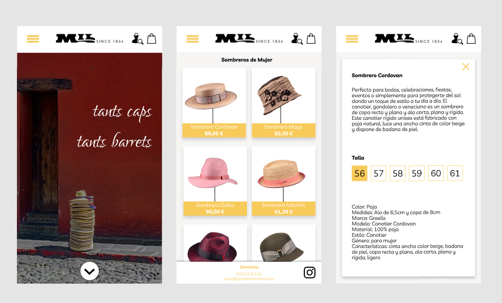
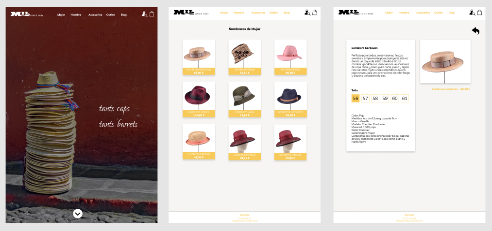
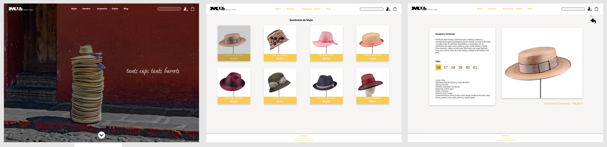

# sombrereriamil

## table of contents

1. [General Info](#general-info)
2. [Design](#design)
3. [Technologies](#technologies)
4. [To do](#to-do)
5. [Collaborators](#collaborators)

## General Info
***
This web page is an e-commerce that sells hats for both women and men, it's for a traditional and antique store, it's responsive and made with html, css and javascript.

## Design
***
The design was made with figma after searching references, we wanted the web to be modern and elegant at the same time, we use the photos that the client give to us.

## Technologies
***
We use html, css and javascript, we split the content in two big sections, the header and the main, and a small third section for footer, for css the header was based in flex and catalogue with grid.

## To do
***
The .... was missing because we didn't have the time it takes.

## Collaborators
***
Gabriela Piñeiro,
Berta López,
Joan Recorda,
Sergio Corcuera,
Alexandra Galarza
